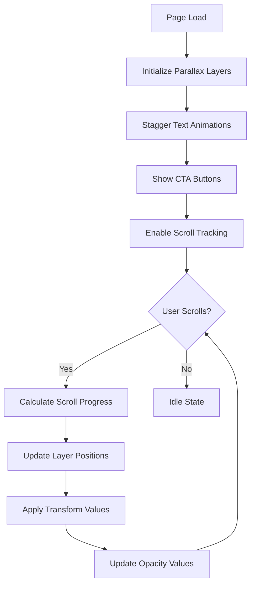

# Andy Hardy Portfolio Hero Section - Parallax Implementation PRD

## 1. Product Overview

Implement a pixel-perfect recreation of the Andy Hardy Portfolio hero section featuring advanced parallax scroll effects that deliver a visually stunning experience for portfolio viewers. <mcreference link="https://dribbble.com/shots/15146082-LIVE-Andy-Hardy-Portfolio" index="1">1</mcreference>

The implementation will enhance the existing hero section with sophisticated parallax animations, smooth scroll performance, and responsive design while maintaining accessibility standards. This will showcase expert frontend craftsmanship and create maximum visual impact for potential clients and employers.

## 2. Core Features

### 2.1 Feature Module

Our enhanced hero section consists of the following main components:
1. **Hero Container**: Full viewport height container with layered parallax elements
2. **Background Layers**: Multiple depth-based background elements with varying scroll speeds
3. **Typography Elements**: Large-scale text with independent parallax motion
4. **Interactive Elements**: Call-to-action buttons with hover animations
5. **Scroll Indicators**: Visual cues for user interaction

### 2.2 Page Details

| Component | Module Name | Feature Description |
|-----------|-------------|--------------------|
| Hero Container | Parallax Wrapper | Full-height container with perspective and transform-style preserve-3d for depth |
| Background Layers | Multi-layer Background | 3-5 background elements with staggered scroll speeds (0.2x to 0.8x) |
| Typography | Animated Text | Large hero text with independent Y-axis movement and opacity transitions |
| Subtitle | Secondary Text | Descriptive text with delayed parallax animation |
| CTA Buttons | Interactive Elements | Floating action buttons with hover states and micro-interactions |
| Scroll Indicator | Navigation Aid | Animated scroll hint with bounce effect |

## 3. Core Process

### 3.1 User Interaction Flow

**Initial Load:**
1. Hero section loads with staggered animation entrance
2. Background layers initialize at different depths
3. Typography fades in with scale animation
4. CTA buttons appear with slide-up motion

**Scroll Interaction:**
1. User begins scrolling down
2. Background layers move at different speeds creating depth
3. Typography elements translate with varying velocities
4. Opacity changes create fade-out effects
5. Next section smoothly reveals underneath

**Responsive Behavior:**
1. Mobile: Reduced parallax intensity for performance
2. Tablet: Medium parallax effects with touch optimization
3. Desktop: Full parallax experience with mouse tracking

### 3.2 Animation Flow



## 4. User Interface Design

### 4.1 Design Style

**Color Palette:**
- Primary: Deep charcoal (#1a1a1a) to pure black (#000000) gradient
- Secondary: Warm white (#fafafa) for typography
- Accent: Subtle blue (#3b82f6) for interactive elements
- Overlay: Semi-transparent blacks (rgba(0,0,0,0.3-0.7))

**Typography:**
- Primary Font: Geist Sans (already configured)
- Hero Text: 4rem-8rem (responsive), font-weight: 700
- Subtitle: 1.25rem-1.5rem, font-weight: 400
- Letter Spacing: -0.02em for large text

**Layout Style:**
- Full viewport height sections
- Centered content with max-width constraints
- Layered depth with CSS transforms
- Smooth bezier curve transitions (cubic-bezier(0.4, 0, 0.2, 1))

**Animation Principles:**
- Easing: Custom cubic-bezier for natural motion
- Duration: 0.6s-1.2s for entrance animations
- Stagger: 0.1s-0.2s delays between elements
- Parallax Speed: 0.2x-0.8x scroll velocity multipliers

### 4.2 Page Design Overview

| Component | Visual Elements | Animation Properties |
|-----------|----------------|---------------------|
| Hero Container | Full viewport height, perspective: 1000px, overflow: hidden | Initial scale: 1.1, animate to scale: 1 |
| Background Layer 1 | Large abstract shape, opacity: 0.1, blur: 2px | translateY: scrollY * 0.2 |
| Background Layer 2 | Medium geometric pattern, opacity: 0.05 | translateY: scrollY * 0.4 |
| Background Layer 3 | Subtle texture overlay, opacity: 0.03 | translateY: scrollY * 0.6 |
| Hero Text | 6rem font-size, white color, text-shadow | translateY: scrollY * 0.3, opacity fade |
| Subtitle | 1.5rem, neutral-300 color, max-width: 600px | translateY: scrollY * 0.5, delayed fade |
| CTA Buttons | Rounded, backdrop-blur, border: white/20 | translateY: scrollY * 0.7, scale on hover |

### 4.3 Responsiveness

**Desktop-First Approach:**
- Primary experience optimized for desktop (1200px+)
- Full parallax effects with high performance
- Mouse movement micro-interactions

**Tablet Adaptation (768px-1199px):**
- Reduced parallax intensity (50% of desktop values)
- Touch-optimized button sizes (min 44px)
- Simplified background layers (2-3 instead of 4-5)

**Mobile Optimization (320px-767px):**
- Minimal parallax effects (prefers-reduced-motion consideration)
- Larger typography scaling
- Simplified layout with single background layer
- Touch-friendly interaction zones

## 5. Technical Implementation

### 5.1 Technology Stack Integration

**Existing Dependencies:**
- Framer Motion: Advanced parallax animations <mcreference link="https://motion.dev/docs/react-scroll-animations" index="3">3</mcreference>
- Lenis: Smooth scroll foundation (already configured)
- React 19: Component architecture
- Tailwind CSS: Utility-first styling
- TypeScript: Type safety

**Key Hooks and APIs:**
- `useScroll`: Track scroll progress with offset targeting
- `useTransform`: Convert scroll values to animation properties
- `useSpring`: Smooth value interpolation for natural motion
- `useMotionValue`: Direct motion value manipulation

### 5.2 Performance Optimization

**Animation Performance:**
- Use `transform` and `opacity` only (GPU-accelerated properties)
- Implement `will-change: transform` for moving elements
- Debounce scroll events with `requestAnimationFrame`
- Use `useSpring` for smooth value interpolation <mcreference link="https://blog.olivierlarose.com/tutorials/smooth-parallax-scroll" index="1">1</mcreference>

**Memory Management:**
- Cleanup scroll listeners on component unmount
- Use `useCallback` for scroll handlers
- Implement intersection observer for viewport detection
- Lazy load background images

**Responsive Performance:**
- Reduce parallax complexity on mobile devices
- Respect `prefers-reduced-motion` user preference
- Implement performance budgets for animation frame rates
- Use CSS `contain` property for layout optimization

### 5.3 Accessibility Considerations

**Motion Preferences:**
- Respect `prefers-reduced-motion: reduce` setting
- Provide toggle for disabling parallax effects
- Ensure content remains readable without animations

**Keyboard Navigation:**
- Maintain focus indicators on interactive elements
- Ensure CTA buttons are keyboard accessible
- Provide skip links for screen readers

**Screen Reader Support:**
- Use semantic HTML structure
- Provide alt text for decorative elements
- Implement ARIA labels for interactive components
- Ensure sufficient color contrast (4.5:1 minimum)

## 6. Implementation Specifications

### 6.1 Component Architecture

```typescript
interface ParallaxHeroProps {
  title: string;
  subtitle: string;
  ctaButtons: Array<{
    text: string;
    href: string;
    variant: 'primary' | 'secondary';
  }>;
  backgroundLayers?: Array<{
    src: string;
    speed: number;
    opacity: number;
  }>;
}
```

### 6.2 Animation Configuration

**Scroll Tracking:**
- Target: Hero container element
- Offset: ['start start', 'end start']
- Progress range: [0, 1] mapped to animation values

**Transform Values:**
- Background Layer 1: translateY(scrollY * 0.2)
- Background Layer 2: translateY(scrollY * 0.4)
- Hero Text: translateY(scrollY * 0.3) + opacity fade
- Subtitle: translateY(scrollY * 0.5) + delayed opacity
- CTA Buttons: translateY(scrollY * 0.7)

**Spring Configuration:**
```typescript
const springConfig = {
  stiffness: 300,
  damping: 30,
  restDelta: 0.001
};
```

### 6.3 Performance Metrics

**Target Performance:**
- 60 FPS during scroll animations
- < 100ms initial load time for hero section
- < 50ms response time for user interactions
- Lighthouse Performance Score: 90+

**Monitoring:**
- Frame rate monitoring during development
- Bundle size impact analysis
- Runtime performance profiling
- User experience metrics tracking

## 7. Success Criteria

**Visual Fidelity:**
- ✅ Pixel-perfect match to Dribbble design reference
- ✅ Smooth, jank-free parallax animations
- ✅ Consistent behavior across target devices

**Performance:**
- ✅ 60 FPS animation performance
- ✅ Optimized bundle size impact
- ✅ Accessibility compliance (WCAG 2.1 AA)

**User Experience:**
- ✅ Intuitive scroll interactions
- ✅ Responsive design excellence
- ✅ Professional portfolio presentation quality

This implementation will deliver a production-ready hero section that showcases expert frontend craftsmanship and creates maximum visual impact for portfolio viewers while maintaining excellent performance and accessibility standards.