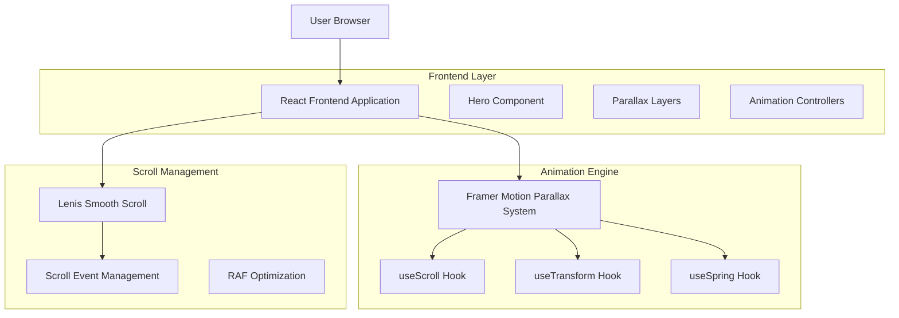
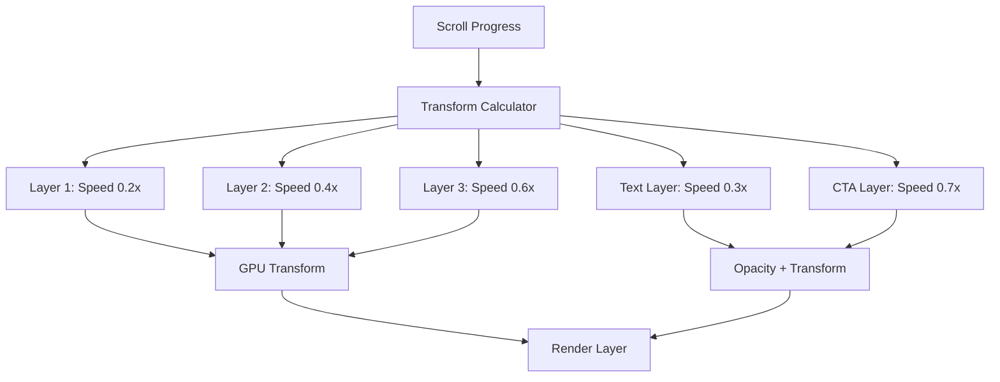

# Andy Hardy Hero Section - Technical Architecture Document

## 1. Architecture Design



## 2. Technology Description

- **Frontend**: React@19 + TypeScript + Tailwind CSS + Vite
- **Animation**: Framer Motion@11 (useScroll, useTransform, useSpring)
- **Scroll**: Lenis@1.1 (already configured)
- **Performance**: RequestAnimationFrame + Intersection Observer
- **Styling**: Tailwind CSS@3 + CSS Custom Properties

## 3. Route Definitions

| Route | Purpose | Hero Integration |
|-------|---------|------------------|
| / | Home page with enhanced hero section | Primary parallax implementation |
| /projects | Projects showcase | Simplified hero variant |
| /about | About page | Minimal parallax version |

## 4. Component Architecture

### 4.1 Core Components

**ParallaxHero Component Structure:**
```typescript
interface ParallaxHeroProps {
  title: string;
  subtitle: string;
  backgroundLayers: BackgroundLayer[];
  ctaButtons: CTAButton[];
  enableParallax?: boolean;
  reducedMotion?: boolean;
}

interface BackgroundLayer {
  id: string;
  src?: string;
  element?: ReactNode;
  speed: number;
  opacity: number;
  blur?: number;
  scale?: number;
}

interface CTAButton {
  text: string;
  href: string;
  variant: 'primary' | 'secondary';
  onClick?: () => void;
}
```

**Animation Hooks:**
```typescript
// Custom hook for parallax scroll tracking
function useParallaxScroll(targetRef: RefObject<HTMLElement>) {
  const { scrollYProgress } = useScroll({
    target: targetRef,
    offset: ['start start', 'end start']
  });
  
  return scrollYProgress;
}

// Custom hook for layer transforms
function useParallaxTransform(scrollProgress: MotionValue<number>, speed: number) {
  return useTransform(scrollProgress, [0, 1], [0, speed * -100]);
}

// Custom hook for smooth spring animations
function useParallaxSpring(value: MotionValue<number>) {
  return useSpring(value, {
    stiffness: 300,
    damping: 30,
    restDelta: 0.001
  });
}
```

### 4.2 Performance Optimization Patterns

**Scroll Event Optimization:**
```typescript
// Debounced scroll handler with RAF
const useOptimizedScroll = () => {
  const rafId = useRef<number>();
  
  const handleScroll = useCallback(() => {
    if (rafId.current) {
      cancelAnimationFrame(rafId.current);
    }
    
    rafId.current = requestAnimationFrame(() => {
      // Parallax calculations here
    });
  }, []);
  
  useEffect(() => {
    return () => {
      if (rafId.current) {
        cancelAnimationFrame(rafId.current);
      }
    };
  }, []);
};
```

**Intersection Observer Integration:**
```typescript
const useViewportVisibility = (ref: RefObject<HTMLElement>) => {
  const [isVisible, setIsVisible] = useState(false);
  
  useEffect(() => {
    const observer = new IntersectionObserver(
      ([entry]) => setIsVisible(entry.isIntersecting),
      { threshold: 0.1 }
    );
    
    if (ref.current) observer.observe(ref.current);
    return () => observer.disconnect();
  }, [ref]);
  
  return isVisible;
};
```

## 5. Animation System Architecture

### 5.1 Parallax Layer System



### 5.2 Motion Value Flow

**Scroll Progress Calculation:**
```typescript
const scrollProgress = useScroll({
  target: heroRef,
  offset: ['start start', 'end start']
}).scrollYProgress;

// Transform mappings for different layers
const backgroundY1 = useTransform(scrollProgress, [0, 1], [0, -200]);
const backgroundY2 = useTransform(scrollProgress, [0, 1], [0, -400]);
const textY = useTransform(scrollProgress, [0, 1], [0, -300]);
const textOpacity = useTransform(scrollProgress, [0, 0.5, 1], [1, 0.5, 0]);

// Spring smoothing
const smoothBackgroundY1 = useSpring(backgroundY1);
const smoothTextY = useSpring(textY);
```

## 6. Responsive Implementation Strategy

### 6.1 Breakpoint-Based Parallax Scaling

```typescript
const useResponsiveParallax = () => {
  const [parallaxScale, setParallaxScale] = useState(1);
  
  useEffect(() => {
    const updateScale = () => {
      const width = window.innerWidth;
      if (width < 768) {
        setParallaxScale(0.3); // Minimal on mobile
      } else if (width < 1024) {
        setParallaxScale(0.6); // Reduced on tablet
      } else {
        setParallaxScale(1); // Full on desktop
      }
    };
    
    updateScale();
    window.addEventListener('resize', updateScale);
    return () => window.removeEventListener('resize', updateScale);
  }, []);
  
  return parallaxScale;
};
```

### 6.2 Motion Preference Detection

```typescript
const useReducedMotion = () => {
  const [prefersReducedMotion, setPrefersReducedMotion] = useState(false);
  
  useEffect(() => {
    const mediaQuery = window.matchMedia('(prefers-reduced-motion: reduce)');
    setPrefersReducedMotion(mediaQuery.matches);
    
    const handleChange = () => setPrefersReducedMotion(mediaQuery.matches);
    mediaQuery.addEventListener('change', handleChange);
    
    return () => mediaQuery.removeEventListener('change', handleChange);
  }, []);
  
  return prefersReducedMotion;
};
```

## 7. Performance Monitoring

### 7.1 Frame Rate Monitoring

```typescript
const usePerformanceMonitor = () => {
  const frameCount = useRef(0);
  const lastTime = useRef(performance.now());
  const [fps, setFps] = useState(60);
  
  useEffect(() => {
    const measureFPS = () => {
      frameCount.current++;
      const currentTime = performance.now();
      
      if (currentTime - lastTime.current >= 1000) {
        setFps(frameCount.current);
        frameCount.current = 0;
        lastTime.current = currentTime;
      }
      
      requestAnimationFrame(measureFPS);
    };
    
    const rafId = requestAnimationFrame(measureFPS);
    return () => cancelAnimationFrame(rafId);
  }, []);
  
  return fps;
};
```

### 7.2 Bundle Size Optimization

**Code Splitting Strategy:**
```typescript
// Lazy load parallax components
const ParallaxHero = lazy(() => import('./components/ParallaxHero'));
const ParallaxBackground = lazy(() => import('./components/ParallaxBackground'));

// Conditional loading based on device capabilities
const useParallaxComponents = () => {
  const [shouldLoadParallax, setShouldLoadParallax] = useState(false);
  
  useEffect(() => {
    const hasGoodPerformance = 
      navigator.hardwareConcurrency >= 4 &&
      !navigator.userAgent.includes('Mobile');
    
    setShouldLoadParallax(hasGoodPerformance);
  }, []);
  
  return shouldLoadParallax;
};
```

## 8. Integration with Existing Codebase

### 8.1 Lenis Smooth Scroll Integration

```typescript
// Enhanced Lenis configuration for parallax
const lenisConfig = {
  duration: 1.2,
  easing: (t: number) => Math.min(1, 1.001 - Math.pow(2, -10 * t)),
  direction: 'vertical',
  gestureDirection: 'vertical',
  smooth: true,
  mouseMultiplier: 1,
  smoothTouch: false,
  touchMultiplier: 2,
  infinite: false,
};

// Sync Framer Motion with Lenis
const useLenisSync = () => {
  useEffect(() => {
    const lenis = new Lenis(lenisConfig);
    
    const raf = (time: number) => {
      lenis.raf(time);
      requestAnimationFrame(raf);
    };
    
    requestAnimationFrame(raf);
    
    return () => lenis.destroy();
  }, []);
};
```

### 8.2 Tailwind CSS Custom Properties

```css
/* Custom CSS properties for parallax layers */
:root {
  --parallax-speed-1: 0.2;
  --parallax-speed-2: 0.4;
  --parallax-speed-3: 0.6;
  --parallax-text-speed: 0.3;
  --parallax-cta-speed: 0.7;
}

@media (max-width: 768px) {
  :root {
    --parallax-speed-1: 0.1;
    --parallax-speed-2: 0.2;
    --parallax-speed-3: 0.3;
    --parallax-text-speed: 0.15;
    --parallax-cta-speed: 0.35;
  }
}

@media (prefers-reduced-motion: reduce) {
  :root {
    --parallax-speed-1: 0;
    --parallax-speed-2: 0;
    --parallax-speed-3: 0;
    --parallax-text-speed: 0;
    --parallax-cta-speed: 0;
  }
}
```

## 9. Testing Strategy

### 9.1 Performance Testing

```typescript
// Performance test utilities
const measureParallaxPerformance = () => {
  const startTime = performance.now();
  let frameCount = 0;
  
  const measureFrame = () => {
    frameCount++;
    const currentTime = performance.now();
    
    if (currentTime - startTime >= 5000) { // 5 second test
      const avgFPS = frameCount / 5;
      console.log(`Average FPS: ${avgFPS}`);
      return;
    }
    
    requestAnimationFrame(measureFrame);
  };
  
  requestAnimationFrame(measureFrame);
};
```

### 9.2 Accessibility Testing

```typescript
// Accessibility test helpers
const testMotionPreferences = () => {
  const prefersReduced = window.matchMedia('(prefers-reduced-motion: reduce)').matches;
  const parallaxElements = document.querySelectorAll('[data-parallax]');
  
  parallaxElements.forEach(element => {
    const transform = getComputedStyle(element).transform;
    if (prefersReduced && transform !== 'none') {
      console.warn('Parallax animation active despite reduced motion preference');
    }
  });
};
```

## 10. Deployment Considerations

### 10.1 Build Optimization

```typescript
// Vite configuration for parallax optimization
export default defineConfig({
  build: {
    rollupOptions: {
      output: {
        manualChunks: {
          'parallax': ['framer-motion'],
          'scroll': ['lenis']
        }
      }
    }
  },
  optimizeDeps: {
    include: ['framer-motion', 'lenis']
  }
});
```

### 10.2 Performance Budgets

**Target Metrics:**
- Initial bundle size increase: < 50KB gzipped
- Runtime memory usage: < 10MB additional
- Animation frame rate: 60 FPS sustained
- Lighthouse Performance Score: > 90
- Core Web Vitals: LCP < 2.5s, FID < 100ms, CLS < 0.1

This technical architecture ensures a robust, performant, and accessible implementation of the Andy Hardy Portfolio hero section parallax effects while maintaining excellent user experience across all devices and user preferences.