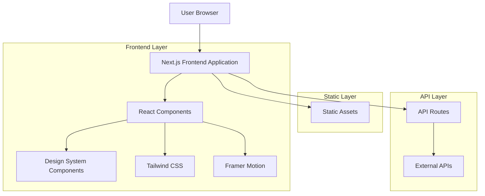
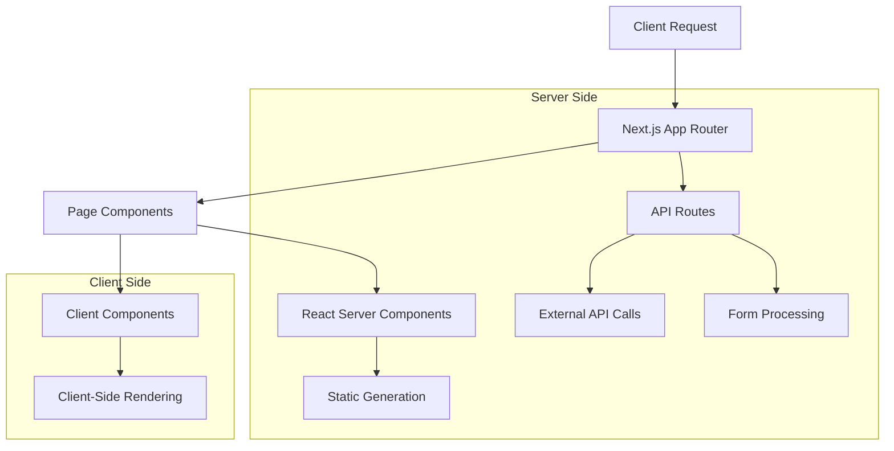
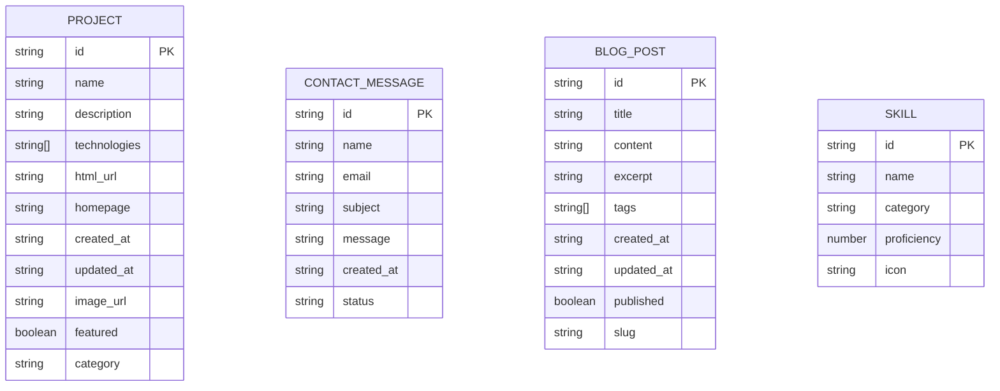
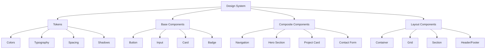
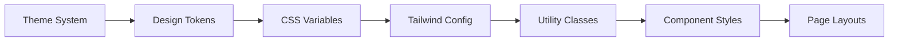

# Technical Architecture Document

## 1. Architecture Design



## 2. Technology Description

- **Frontend**: Next.js 14 + React 18 + TypeScript + Tailwind CSS 3
- **Styling**: Tailwind CSS + Custom CSS Variables + Framer Motion
- **State Management**: React Hooks + SWR for data fetching
- **Build Tool**: Next.js built-in bundler (Turbopack)
- **Deployment**: Vercel (recommended) or static hosting

## 3. Route Definitions

| Route | Purpose |
|-------|----------|
| / | Home page with hero section, featured projects, and contact |
| /projects | Detailed projects showcase with filtering and search |
| /about | About page with personal information and skills |
| /contact | Contact form and social media links |
| /blog | Blog posts and articles (optional) |
| /api/projects | API endpoint for fetching project data |
| /api/contact | API endpoint for handling contact form submissions |

## 4. API Definitions

### 4.1 Core API

**Project Data Fetching**
```
GET /api/projects
```

Response:
| Param Name | Param Type | Description |
|------------|------------|-------------|
| projects | Project[] | Array of project objects |
| total | number | Total number of projects |
| page | number | Current page number |

Example Response:
```json
{
  "projects": [
    {
      "id": "1",
      "name": "Portfolio Website",
      "description": "Modern portfolio built with Next.js",
      "technologies": ["Next.js", "React", "Tailwind CSS"],
      "html_url": "https://github.com/user/portfolio",
      "homepage": "https://portfolio.example.com",
      "created_at": "2024-01-01T00:00:00Z",
      "updated_at": "2024-01-15T00:00:00Z"
    }
  ],
  "total": 10,
  "page": 1
}
```

**Contact Form Submission**
```
POST /api/contact
```

Request:
| Param Name | Param Type | isRequired | Description |
|------------|------------|------------|-------------|
| name | string | true | Sender's name |
| email | string | true | Sender's email address |
| subject | string | true | Message subject |
| message | string | true | Message content |

Response:
| Param Name | Param Type | Description |
|------------|------------|-------------|
| success | boolean | Whether the message was sent successfully |
| message | string | Response message |

Example Request:
```json
{
  "name": "John Doe",
  "email": "john@example.com",
  "subject": "Project Inquiry",
  "message": "I'd like to discuss a potential project..."
}
```

Example Response:
```json
{
  "success": true,
  "message": "Message sent successfully"
}
```

## 5. Server Architecture Diagram



## 6. Data Model

### 6.1 Data Model Definition



### 6.2 TypeScript Interface Definitions

**Project Interface**
```typescript
interface Project {
  id: string;
  name: string;
  description: string;
  technologies: string[];
  html_url?: string;
  homepage?: string;
  created_at: string;
  updated_at: string;
  image_url?: string;
  featured?: boolean;
  category?: string;
}
```

**Contact Message Interface**
```typescript
interface ContactMessage {
  id: string;
  name: string;
  email: string;
  subject: string;
  message: string;
  created_at: string;
  status: 'pending' | 'read' | 'replied';
}
```

**Blog Post Interface**
```typescript
interface BlogPost {
  id: string;
  title: string;
  content: string;
  excerpt: string;
  tags: string[];
  created_at: string;
  updated_at: string;
  published: boolean;
  slug: string;
}
```

**Skill Interface**
```typescript
interface Skill {
  id: string;
  name: string;
  category: 'frontend' | 'backend' | 'tools' | 'design';
  proficiency: number; // 1-100
  icon: string;
}
```

## 7. Design System Architecture

### 7.1 Component Hierarchy



### 7.2 Styling Architecture



## 8. Performance Considerations

### 8.1 Optimization Strategies

- **Code Splitting**: Automatic with Next.js App Router
- **Image Optimization**: Next.js Image component with WebP/AVIF
- **CSS Optimization**: Tailwind CSS purging unused styles
- **Bundle Analysis**: Built-in Next.js bundle analyzer
- **Caching**: Static generation for pages, SWR for data

### 8.2 Performance Metrics

| Metric | Target | Current |
|--------|--------|---------|
| First Contentful Paint | < 1.5s | TBD |
| Largest Contentful Paint | < 2.5s | TBD |
| Cumulative Layout Shift | < 0.1 | TBD |
| Time to Interactive | < 3.5s | TBD |
| Bundle Size | < 250KB | TBD |

## 9. Development Workflow

### 9.1 Development Setup

```bash
# Install dependencies
npm install

# Start development server
npm run dev

# Build for production
npm run build

# Start production server
npm start

# Lint code
npm run lint

# Type check
npm run type-check
```

### 9.2 File Structure

```
src/
├── app/                 # Next.js App Router
│   ├── globals.css     # Global styles
│   ├── layout.tsx      # Root layout
│   ├── page.tsx        # Home page
│   └── api/            # API routes
├── components/         # React components
│   ├── ui/             # Base UI components
│   ├── sections/       # Page sections
│   └── layout/         # Layout components
├── hooks/              # Custom React hooks
├── lib/                # Utility functions
├── types/              # TypeScript definitions
└── styles/             # Additional styles
```

## 10. Deployment Strategy

### 10.1 Vercel Deployment (Recommended)

- **Automatic deployments** from Git repository
- **Preview deployments** for pull requests
- **Edge functions** for API routes
- **Image optimization** built-in
- **Analytics** and performance monitoring

### 10.2 Alternative Deployment Options

- **Netlify**: Static site hosting with serverless functions
- **AWS Amplify**: Full-stack deployment with CI/CD
- **GitHub Pages**: Static hosting (requires static export)
- **Docker**: Containerized deployment for any platform

## 11. Security Considerations

### 11.1 Frontend Security

- **Content Security Policy**: Prevent XSS attacks
- **Input Validation**: Sanitize user inputs
- **HTTPS Only**: Enforce secure connections
- **Environment Variables**: Secure API keys and secrets

### 11.2 API Security

- **Rate Limiting**: Prevent abuse of API endpoints
- **CORS Configuration**: Control cross-origin requests
- **Input Sanitization**: Validate and clean user data
- **Error Handling**: Don't expose sensitive information

## 12. Monitoring and Analytics

### 12.1 Performance Monitoring

- **Vercel Analytics**: Built-in performance metrics
- **Google Lighthouse**: Regular performance audits
- **Web Vitals**: Core web vitals tracking
- **Bundle Analyzer**: Monitor bundle size growth

### 12.2 User Analytics

- **Google Analytics**: User behavior tracking
- **Vercel Analytics**: Privacy-friendly analytics
- **Error Tracking**: Monitor and fix runtime errors
- **A/B Testing**: Optimize user experience

This technical architecture provides a solid foundation for implementing the design system while maintaining scalability, performance, and maintainability.