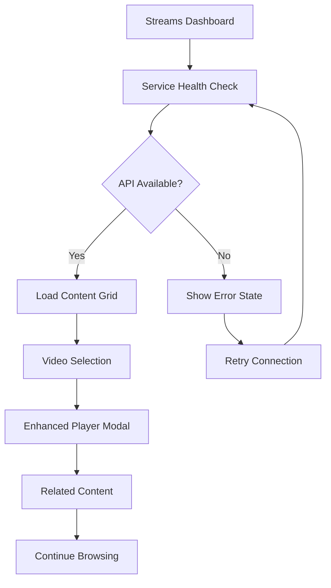

# YouTube Content Streaming System - Product Requirements Document

## 1. Product Overview

A complete architectural redesign of the YouTube content streaming functionality, implementing modern streaming architecture with environment-based configuration, real-time updates, and enhanced performance optimization. The system transforms the existing basic YouTube integration into a robust, scalable streaming platform that maintains all core capabilities while significantly improving maintainability, performance, and user experience.

## 2. Core Features

### 2.1 User Roles

| Role | Registration Method | Core Permissions |
|------|---------------------|------------------|
| Viewer | Direct access | Can browse YouTube content, view videos in modal, navigate streams |
| Content Manager | Environment configuration | Can configure API settings, monitor service health, manage content policies |

### 2.2 Feature Module

Our redesigned YouTube streaming system consists of the following main components:

1. **Streams Dashboard**: Real-time content grid, service health indicators, advanced filtering and search
2. **Video Player Modal**: Enhanced video playback, metadata display, related content suggestions
3. **Configuration Management**: Environment-based settings, API key validation, service monitoring
4. **Content Cache System**: Intelligent caching, background refresh, offline fallback
5. **Analytics Dashboard**: Performance metrics, usage statistics, error tracking

### 2.3 Page Details

| Page Name | Module Name | Feature description |
|-----------|-------------|---------------------|
| Streams Dashboard | Content Grid | Display YouTube videos in responsive grid layout with lazy loading, thumbnail optimization, and infinite scroll |
| Streams Dashboard | Service Health Monitor | Real-time status indicators for YouTube API, cache system, and network connectivity with automatic failover |
| Streams Dashboard | Advanced Filtering | Filter content by date, duration, view count, and custom tags with search functionality |
| Video Player Modal | Enhanced Player | Embedded YouTube player with custom controls, quality selection, and playback speed options |
| Video Player Modal | Metadata Display | Show video title, description, publish date, view count, and channel information |
| Video Player Modal | Related Content | Suggest related videos from the same channel with smart recommendations |
| Configuration Management | Environment Validation | Validate API keys, channel IDs, and configuration parameters with detailed error messages |
| Configuration Management | Service Monitoring | Monitor API quota usage, response times, and error rates with alerting |
| Content Cache System | Intelligent Caching | Cache video metadata, thumbnails, and API responses with TTL-based invalidation |
| Content Cache System | Background Refresh | Automatically refresh content in background to ensure fresh data without user wait times |
| Analytics Dashboard | Performance Metrics | Track loading times, cache hit rates, API response times, and user engagement |
| Analytics Dashboard | Usage Statistics | Monitor content views, popular videos, user interaction patterns, and service utilization |

## 3. Core Process

### Main User Flow

1. **Content Discovery**: User navigates to Streams section and sees real-time YouTube content grid
2. **Service Health Check**: System automatically validates YouTube API connectivity and displays status
3. **Content Browsing**: User can filter, search, and browse videos with smooth infinite scroll
4. **Video Viewing**: User clicks video to open enhanced modal player with full metadata
5. **Related Content**: System suggests related videos and enables seamless content discovery

### Content Manager Flow

1. **Configuration Setup**: Configure YouTube API credentials and channel settings via environment variables
2. **Service Monitoring**: Monitor API quota, response times, and system health through dashboard
3. **Cache Management**: Configure cache policies, TTL settings, and background refresh intervals
4. **Analytics Review**: Analyze performance metrics, usage patterns, and optimization opportunities

## 4. User Interface Design

### 4.1 Design Style

- **Primary Colors**: Deep black (#000000) background, white (#FFFFFF) text, blue accent (#3B82F6)
- **Secondary Colors**: Neutral grays (#404040, #808080) for secondary text and borders
- **Button Style**: Rounded corners (8px), subtle hover animations, gradient backgrounds for CTAs
- **Typography**: Inter font family, 16px base size, clear hierarchy with 24px/32px/48px headings
- **Layout Style**: Card-based grid system, top navigation, responsive breakpoints, smooth transitions
- **Icons**: Lucide React icons, 20px standard size, consistent stroke width, contextual colors

### 4.2 Page Design Overview

| Page Name | Module Name | UI Elements |
|-----------|-------------|-------------|
| Streams Dashboard | Content Grid | Masonry grid layout, 300px card width, hover animations, skeleton loading states, infinite scroll indicator |
| Streams Dashboard | Service Health | Top banner with status indicators, color-coded badges (green/yellow/red), expandable error details |
| Streams Dashboard | Filter Controls | Horizontal filter bar, dropdown selectors, search input with autocomplete, clear filters button |
| Video Player Modal | Player Container | Full-width responsive iframe, 16:9 aspect ratio, custom overlay controls, loading spinner |
| Video Player Modal | Metadata Panel | Side panel with video details, formatted timestamps, view counts, expandable descriptions |
| Configuration Management | Settings Panel | Form-based configuration, real-time validation, success/error states, help tooltips |
| Analytics Dashboard | Metrics Cards | KPI cards with trend indicators, charts using Chart.js, responsive grid layout, export options |

### 4.3 Responsiveness

Desktop-first responsive design with mobile optimization. Touch interaction support for mobile devices including swipe gestures for video navigation, optimized tap targets (44px minimum), and adaptive grid layouts (1-2-3-4 columns based on screen size).
