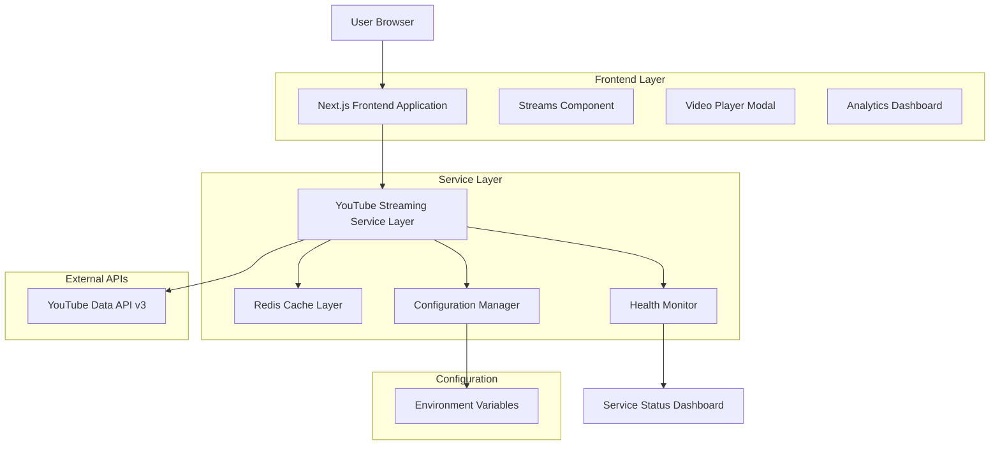
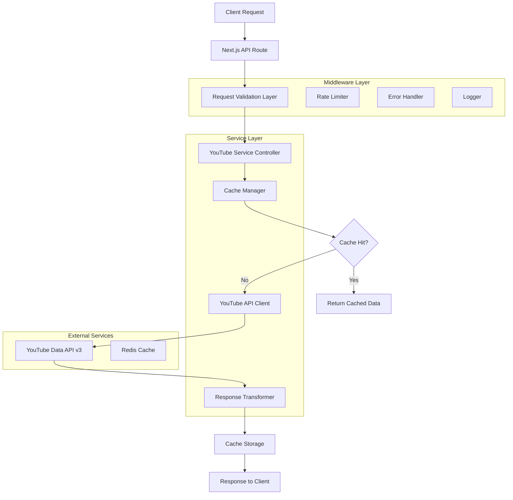
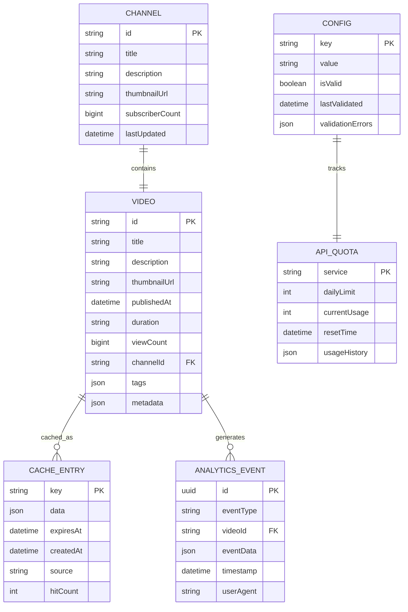

# YouTube Content Streaming System - Technical Architecture Document

## 1. Architecture Design



## 2. Technology Description

- **Frontend**: React@18 + Next.js@14 + TypeScript + Tailwind CSS@3 + SWR for data fetching
- **Backend**: Next.js API Routes + Node.js runtime
- **Caching**: Redis for content caching and session management
- **External APIs**: YouTube Data API v3 for content retrieval
- **Monitoring**: Custom health check system with real-time status updates
- **Testing**: Vitest + React Testing Library + Playwright for E2E

## 3. Route Definitions

| Route | Purpose |
|-------|---------|
| /streams | Main streams dashboard with YouTube content grid and filtering |
| /api/youtube/videos | Fetch YouTube videos with caching and error handling |
| /api/youtube/health | YouTube API health check and quota monitoring |
| /api/youtube/config | Configuration validation and environment variable checks |
| /api/cache/invalidate | Manual cache invalidation for content refresh |
| /api/analytics/metrics | Performance and usage analytics data |

## 4. API Definitions

### 4.1 Core API

**YouTube Videos Endpoint**
```
GET /api/youtube/videos
```

Request Parameters:
| Param Name | Param Type | isRequired | Description |
|------------|------------|------------|-------------|
| maxResults | number | false | Number of videos to fetch (default: 10, max: 50) |
| order | string | false | Sort order: date, relevance, viewCount (default: date) |
| publishedAfter | string | false | ISO 8601 timestamp for filtering recent content |
| pageToken | string | false | Token for pagination |

Response:
| Param Name | Param Type | Description |
|------------|------------|-------------|
| items | VideoItem[] | Array of video objects with metadata |
| nextPageToken | string | Token for next page of results |
| totalResults | number | Total number of available videos |
| cacheInfo | CacheInfo | Cache status and TTL information |

Example Response:
```json
{
  "items": [
    {
      "id": "dQw4w9WgXcQ",
      "title": "Sample Video Title",
      "description": "Video description...",
      "thumbnailUrl": "https://i.ytimg.com/vi/dQw4w9WgXcQ/maxresdefault.jpg",
      "publishedAt": "2023-12-01T10:00:00Z",
      "duration": "PT3M42S",
      "viewCount": "1000000",
      "channelTitle": "Channel Name",
      "tags": ["tag1", "tag2"]
    }
  ],
  "nextPageToken": "CAUQAA",
  "totalResults": 150,
  "cacheInfo": {
    "cached": true,
    "ttl": 600,
    "lastUpdated": "2023-12-01T10:00:00Z"
  }
}
```

**Health Check Endpoint**
```
GET /api/youtube/health
```

Response:
| Param Name | Param Type | Description |
|------------|------------|-------------|
| status | string | overall, youtube, cache, config |
| services | ServiceHealth[] | Individual service health status |
| quota | QuotaInfo | API quota usage information |
| lastCheck | string | ISO timestamp of last health check |

**Configuration Validation**
```
POST /api/youtube/config/validate
```

Request:
| Param Name | Param Type | isRequired | Description |
|------------|------------|------------|-------------|
| apiKey | string | true | YouTube API key to validate |
| channelId | string | true | YouTube channel ID to validate |

Response:
| Param Name | Param Type | Description |
|------------|------------|-------------|
| valid | boolean | Whether configuration is valid |
| errors | string[] | Array of validation error messages |
| suggestions | string[] | Helpful suggestions for fixing issues |

## 5. Server Architecture Diagram



## 6. Data Model

### 6.1 Data Model Definition



### 6.2 Data Definition Language

**Cache Management (Redis)**
```redis
# Video cache with TTL
SET youtube:videos:{channelId}:{params_hash} "{json_data}" EX 600

# Health status cache
SET youtube:health:status "{health_data}" EX 60

# API quota tracking
SET youtube:quota:daily "{quota_data}" EX 86400

# Configuration cache
SET youtube:config:validated "{config_data}" EX 3600
```

**Environment Variables Schema**
```bash
# Required YouTube API Configuration
YOUTUBE_API_KEY=your_youtube_api_key_here
YOUTUBE_CHANNEL_ID=your_channel_id_here

# Optional Cache Configuration
REDIS_URL=redis://localhost:6379
CACHE_TTL_VIDEOS=600
CACHE_TTL_HEALTH=60

# Optional Performance Settings
YOUTUBE_MAX_RESULTS=50
YOUTUBE_REQUEST_TIMEOUT=10000
YOUTUBE_RETRY_ATTEMPTS=3

# Optional Monitoring
ANALYTICS_ENABLED=true
HEALTH_CHECK_INTERVAL=300
QUOTA_WARNING_THRESHOLD=0.8
```

**TypeScript Interfaces**
```typescript
interface VideoItem {
  id: string;
  title: string;
  description: string;
  thumbnailUrl: string;
  publishedAt: string;
  duration: string;
  viewCount: string;
  channelId: string;
  channelTitle: string;
  tags: string[];
  metadata?: Record<string, unknown>;
}

interface CacheInfo {
  cached: boolean;
  ttl: number;
  lastUpdated: string;
  hitCount?: number;
}

interface ServiceHealth {
  service: 'youtube' | 'cache' | 'config';
  status: 'healthy' | 'degraded' | 'down';
  responseTime?: number;
  lastCheck: string;
  error?: string;
}

interface QuotaInfo {
  service: string;
  dailyLimit: number;
  currentUsage: number;
  remainingQuota: number;
  resetTime: string;
  warningThreshold: number;
}

interface YouTubeConfig {
  apiKey: string;
  channelId: string;
  maxResults: number;
  cacheTTL: number;
  retryAttempts: number;
  requestTimeout: number;
}
```

## 7. Implementation Strategy

### 7.1 Phase 1: Core Infrastructure
- Environment configuration system
- YouTube API client with error handling
- Basic caching layer with Redis
- Health monitoring foundation

### 7.2 Phase 2: Enhanced Features
- Advanced caching strategies
- Real-time health dashboard
- Performance analytics
- Background content refresh

### 7.3 Phase 3: Optimization
- Intelligent cache warming
- Predictive content loading
- Advanced error recovery
- Performance monitoring

### 7.4 Testing Strategy
- Unit tests for all service functions
- Integration tests for API endpoints
- E2E tests for user workflows
- Performance tests for caching
- Load tests for API limits

### 7.5 Deployment Considerations
- Environment variable validation on startup
- Graceful degradation for API failures
- Cache warming strategies
- Monitoring and alerting setup
- Rollback procedures for failed deployments
